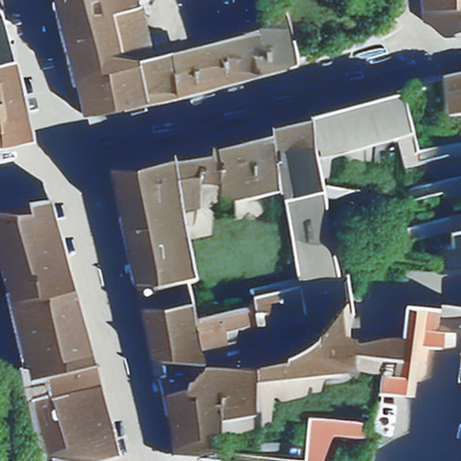
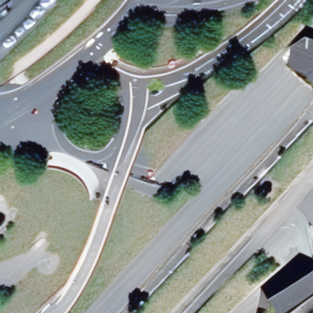
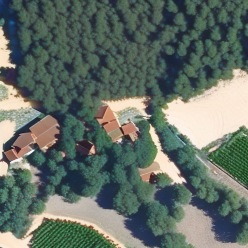
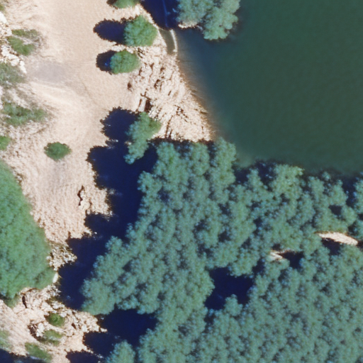

AerialDreams
======

## Description

AerialDreams is a project that explores the potential of utilizing algorithms such as [StableDiffusion](https://github.com/CompVis/stable-diffusion) and [ControlNet](https://github.com/lllyasviel/ControlNet) to generate aerial images based on image segmentation data. By leveraging IGN's [FLAIR (French Land cover from Aerospace ImageRy)](https://ignf.github.io/FLAIR/) dataset, which provides land cover information for various regions in France, this project aims to create visually appealing synthetic aerial photographs that resemble real aerial imagery.

Ground Truth               |  Image Segmentation      |  Generated Image
:-------------------------:|:------------------------:|:-------------------------:
     |    |  
     |    |  
     |    |  
     |    |  

   
Legend from the FLAIR dataset documentation

   <table style="width:80%;max-width:700px;">
      <thead>
         <tr>
            <th width="7%"></th>
            <th>Class</th>
            <th style="text-align: center" width="15%">Value</th>
            <th style="text-align: center">Freq.-train (%)</th>
            <th style="text-align: center">Freq.-test (%)</th>
         </tr>
      </thead>
      <tbody>
         <tr>
            <td></td>
            <td>building</td>
            <td style="text-align: center">1</td>
            <td style="text-align: center">8.14</td>
            <td style="text-align: center">8.6</td>
         </tr>
         <tr>
            <td></td>
            <td>pervious surface</td>
            <td style="text-align: center">2</td>
            <td style="text-align: center">8.25</td>
            <td style="text-align: center">7.34</td>
         </tr>
         <tr>
            <td></td>
            <td>impervious surface</td>
            <td style="text-align: center">3</td>
            <td style="text-align: center">13.72</td>
            <td style="text-align: center">14.98</td>
         </tr>
         <tr>
            <td></td>
            <td>bare soil</td>
            <td style="text-align: center">4</td>
            <td style="text-align: center">3.47</td>
            <td style="text-align: center">4.36</td>
         </tr>
         <tr>
            <td></td>
            <td>water</td>
            <td style="text-align: center">5</td>
            <td style="text-align: center">4.88</td>
            <td style="text-align: center">5.98</td>
         </tr>
         <tr>
            <td bgcolor="#194a26"></td>
            <td>coniferous</td>
            <td style="text-align: center">6</td>
            <td style="text-align: center">2.74</td>
            <td style="text-align: center">2.39</td>
         </tr>
         <tr>
            <td bgcolor="#46e483"></td>
            <td>deciduous</td>
            <td style="text-align: center">7</td>
            <td style="text-align: center">15.38</td>
            <td style="text-align: center">13.91</td>
         </tr>
         <tr>
            <td bgcolor="#f3a60d"></td>
            <td>brushwood</td>
            <td style="text-align: center">8</td>
            <td style="text-align: center">6.95</td>
            <td style="text-align: center">6.91</td>
         </tr>
         <tr>
            <td bgcolor="#660082"></td>
            <td>vineyard</td>
            <td style="text-align: center">9</td>
            <td style="text-align: center">3.13</td>
            <td style="text-align: center">3.87</td>
         </tr>
         <tr>
            <td bgcolor="#55ff00"></td>
            <td>herbaceous vegetation</td>
            <td style="text-align: center">10</td>
            <td style="text-align: center">17.84</td>
            <td style="text-align: center">22.17</td>
         </tr>
         <tr>
            <td bgcolor="#fff30d"></td>
            <td>agricultural land</td>
            <td style="text-align: center">11</td>
            <td style="text-align: center">10.98</td>
            <td style="text-align: center">6.95</td>
         </tr>
         <tr>
            <td bgcolor="#e4df7c"></td>
            <td>plowed land</td>
            <td style="text-align: center">12</td>
            <td style="text-align: center">3.88</td>
            <td style="text-align: center">2.25</td>
         </tr>
         <tr>
            <td bgcolor="#3de6eb"></td>
            <td>swimming pool</td>
            <td style="text-align: center">13</td>
            <td style="text-align: center">0.03</td>
            <td style="text-align: center">0.04</td>
         </tr>
         <tr>
            <td bgcolor="#ffffff"></td>
            <td>snow</td>
            <td style="text-align: center">14</td>
            <td style="text-align: center">0.15</td>
            <td style="text-align: center">-</td>
         </tr>
         <tr>
            <td bgcolor="#8ab3a0"></td>
            <td>clear cut</td>
            <td style="text-align: center">15</td>
            <td style="text-align: center">0.15</td>
            <td style="text-align: center">0.01</td>
         </tr>
         <tr>
            <td bgcolor="#6b714f"></td>
            <td>mixed</td>
            <td style="text-align: center">16</td>
            <td style="text-align: center">0.05</td>
            <td style="text-align: center">-</td>
         </tr>
         <tr>
            <td bgcolor="#c5dc42"></td>
            <td>ligneous</td>
            <td style="text-align: center">17</td>
            <td style="text-align: center">0.01</td>
            <td style="text-align: center">0.03</td>
         </tr>
         <tr>
            <td bgcolor="#9999ff"></td>
            <td>greenhouse</td>
            <td style="text-align: center">18</td>
            <td style="text-align: center">0.12</td>
            <td style="text-align: center">0.2</td>
         </tr>
         <tr>
            <td bgcolor="#000000"></td>
            <td>other</td>
            <td style="text-align: center">19</td>
            <td style="text-align: center">0.14</td>
            <td style="text-align: center">-</td>
         </tr>
      </tbody>
   </table>

 

<!---
## How to use

You can play with the model on the dedicated HuggingFace space or run it locally.

-->

## Download the model

The trained weights will soon be available on HuggingFace

 

## About the dataset

To facilitate the use of StableDiffusion, a custom dataset has been derived from the FLAIR dataset. The TIFF images have been converted to PNG format for convenience, and the image segmentation process incorporates the recommended Look-Up Table (LUT) from the dataset documentation. Location data and descriptions have been gathered from the TIF files and the OpenStreetMap API to enrich the dataset, enabling the creation of meaningful labels for each image.  

Each label is in the form `Aerial view of <OSM display_name>. <classes>`  
*e.g. Aerial view of Pays de la Loire, France métropolitaine, 49260, France. brushwood, deciduous, herbaceous vegetation*

The complete dataset, consisting of over 61,000 images, can be accessed on HuggingFace [here](https://huggingface.co/datasets/rgres/AerialDreams).

 

## File Structure

The project consists of the following files and directories:

- `validation/`: A directory containing validation images, masks and prompts.
- `scripts/`: A directory containing utility scripts to convert and enrich the FLAIR dataset for this project.

 

## Limitations

One limitation of this project is that the FLAIR dataset covers France only. As a result, the learned representation and generated images may be biased towards French terrain. The model might struggle to accurately render other types of terrain outside of France. Future improvements could involve expanding the dataset to include a more diverse range of regions and landscapes.  

Also theses results are obtained using a ControlNet on the base StableDiffusion 2.1 model. More details could be obtained in the generated images by finetuning a diffusion model on aerial imaging.
