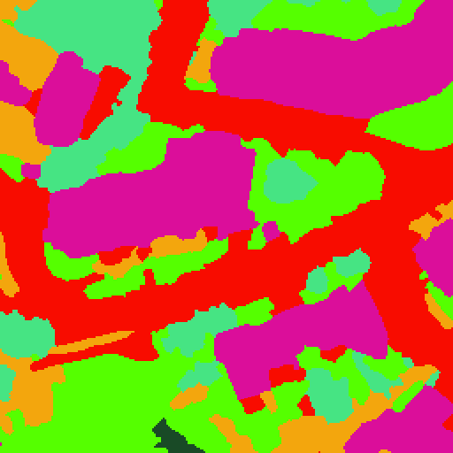
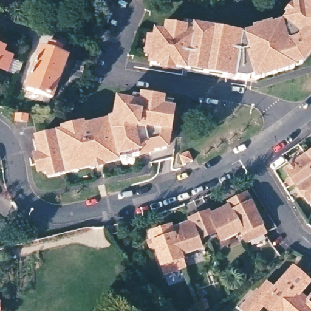

SatelliteDreams
======

This project aims to generate fake satellite images from image segmentation using StableDiffusion, ControlNet and the [OCSGE dataset](https://ignf.github.io/FLAIR/).

The final goal is to get something like this:

Image Segmentation         |  Generated Output
:-------------------------:|:-------------------------:
     |  

## Limitations

The OCS GE dataset covers France only, this will introduce a biais in the learned terrain representation.